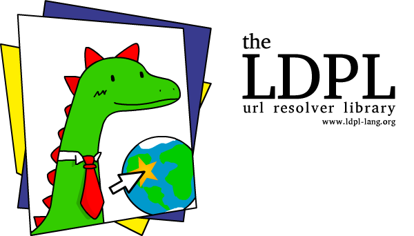

**The LDPL URL Resolver Library** is a super easy to use library for [LDPL](https://www.github.com/lartu/ldpl) that helps you 
resolve URLs into their respective IP addresses. This library requires **LDPL 4.3** or greater.

## 🧰 Installation

You can install this library **by hand** or **using [LPM](https://github.com/Lartu/ldpl#-libraries)**.

### 📦 Installing using LPM

Open a terminal and write `lpm install ldpl-url-resolver`. Once downloaded, include it in your LDPL project by adding the line:

```coffeescript
using package ldpl-url-resolver
```

before the `data` and `procedure` sections of your source file. The library is ready to be used.

### ✋🏻 Installing by hand

Include the library into your LDPL project by copying the folder *ldpl-url-resolver* to your project directory and then adding the line:

```coffeescript
include "ldpl-url-resolver/ldpl-url-resolver.ldpl"
```

before the `data` and `procedure` sections of your source file. The library is
ready to be used.

## 📚 Documentation

This library adds a single new statement to the language:
 - `resolve url <text> in <text-var>` resolves the url `<text>` and stores the resulting IP in `<text-var>`.

## 🏫 Example

```coffeescript
using package ldpl-url-resolver
data:
  ip is text
procedure:
  resolve url "www.ldpl-lang.org" in ip
  display "The ip for www.ldpl-lang.org is " ip lf
```

## :scroll: License
This library is released under the MIT License.
